# Lucrarea de laborator nr. 2. Introducere în WordPress

## Scopul lucrării

Să înveț cum să instalez WordPress într-un mediu local, să mă familiarizez cu panoul de administrare, să modific aspectul site-ului prin teme și să extind funcționalitatea acestuia cu ajutorul plugin-urilor.

---

## Pasul 1. Pregătirea mediului

A fost instalat XAMPP, iar modulele **Apache** și **MySQL** au fost pornite. Accesând `http://localhost`, s-a confirmat că serverul local funcționează corect.

În **phpMyAdmin** (`http://localhost/phpmyadmin`) a fost creată o bază de date nouă cu numele `wp_lab2`, cu colecția de caractere `utf8mb4_general_ci`.

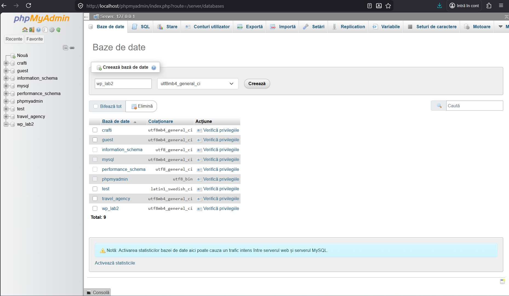

> Baza de date `wp_lab2` apare în lista bazelor de date din phpMyAdmin.

---

## Pasul 2. Instalarea WordPress

Fișierele WordPress au fost descărcate de pe [wordpress.org](https://wordpress.org) și dezarhivate în folderul `htdocs/wp_lab2`.

La deschiderea `http://localhost/wp_lab2` în browser, a pornit procesul de instalare:

1. **Selectarea limbii** — English (United States).

   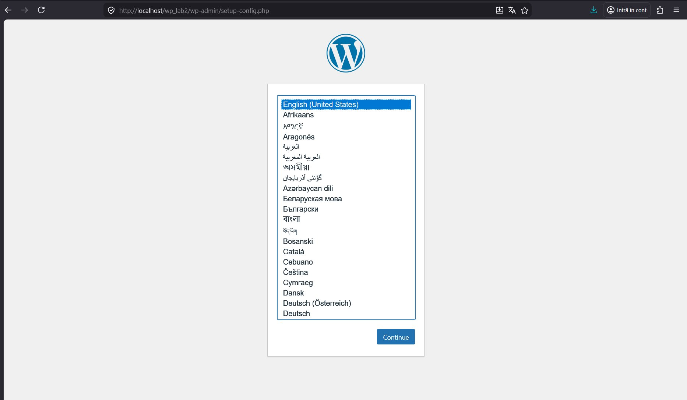

2. **Configurarea bazei de date** — s-au completat datele de conectare:
   - Database Name: `wp_lab2`
   - Username: `root`
   - Password: *(gol)*
   - Database Host: `localhost`
   - Table Prefix: `wp_`

   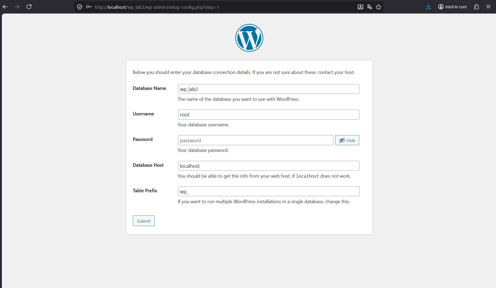

3. **Configurarea site-ului** — s-au introdus datele:
   - Site Title: `lab2`
   - Username: `root`
   - Password: `toor`
   - Email: `niculupu70@gmail.com`

   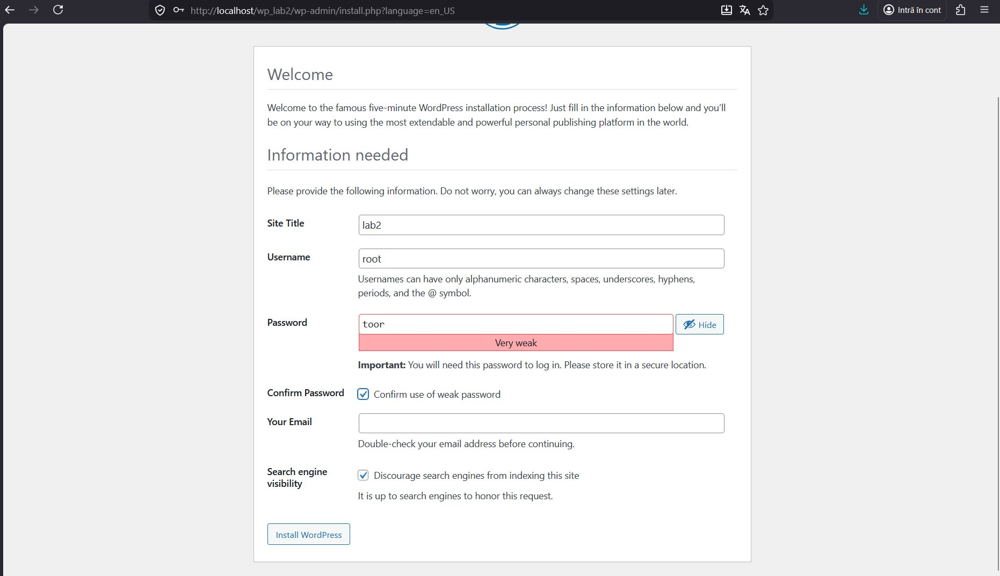

4. WordPress a fost instalat cu succes. S-a accesat panoul de administrare la `http://localhost/wp_lab2/wp-admin/`.

   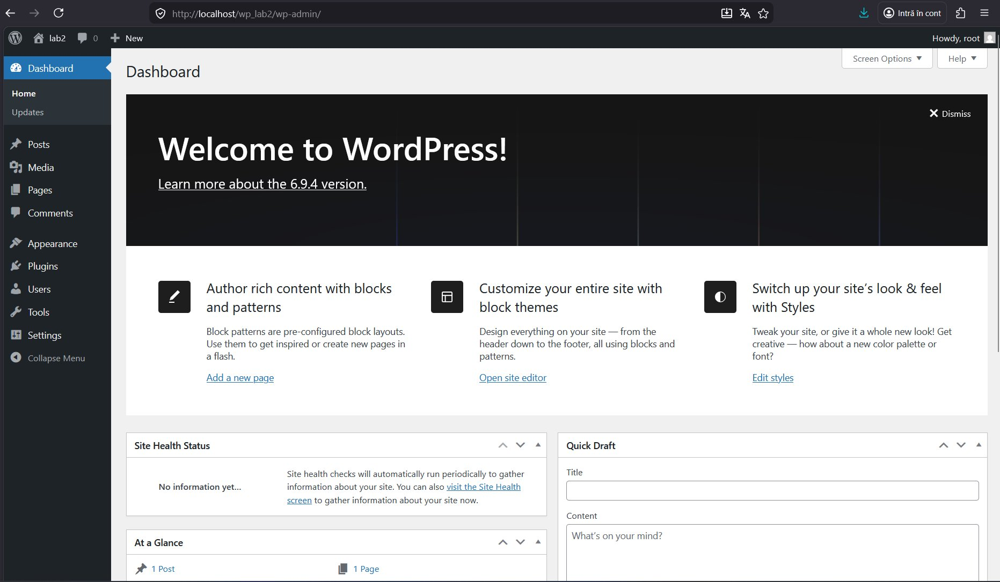

---

## Pasul 3. Setările inițiale ale site-ului

### Settings → General

În panoul de administrare a fost modificat:
- **Site Title**: `VR Hub`
- **Tagline**: *(șters)*
- **Timezone**: corespunzător fusului orar local

### Settings → Permalinks

A fost selectată opțiunea **Post name** pentru URL-uri prietenoase (ex: `http://localhost/wp_lab2/sample-post/`).

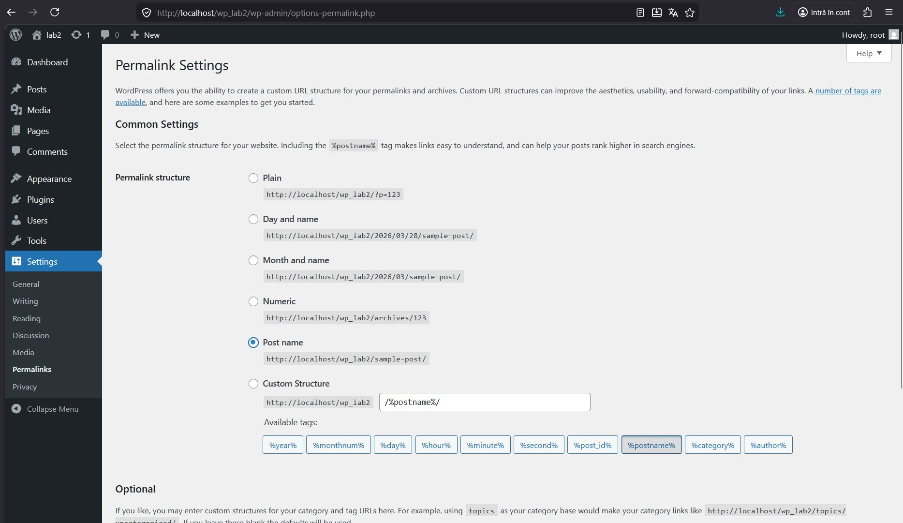

---

## Pasul 4. Lucrul cu teme

### Instalarea și activarea temei

Din secțiunea **Appearance → Themes → Add New** a fost căutată și instalată tema **VR Hub** (temă din catalogul oficial). Tema a fost activată.

### Personalizarea prin Appearance → Customize

Au fost configurate:
- **Logoul site-ului** — a fost încărcat un logo personalizat (VR Hub logo).
- **Site Icon (Favicon)** — a fost setat iconița site-ului.
- **Site Title**: `VR Hub`

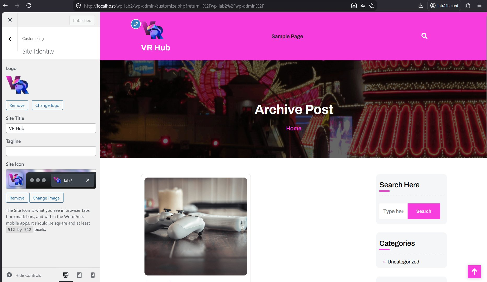

### Rezultatul pe site

După activarea temei și personalizare, site-ul afișează un design modern cu fundal gradient violet-albastru, grilă de postări și sidebar cu widget-uri.

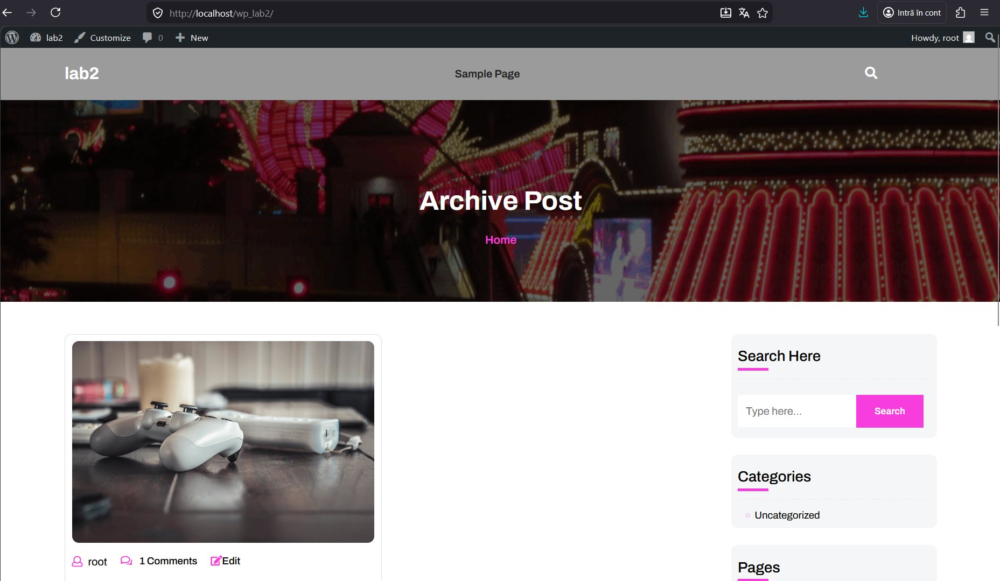

---

## Pasul 5. Lucrul cu plugin-uri

### Instalarea plugin-urilor

Din **Plugins → Add New** au fost căutate și instalate:

1. **Classic Editor** — restabilește editorul clasic TinyMCE în locul editorului Gutenberg.

   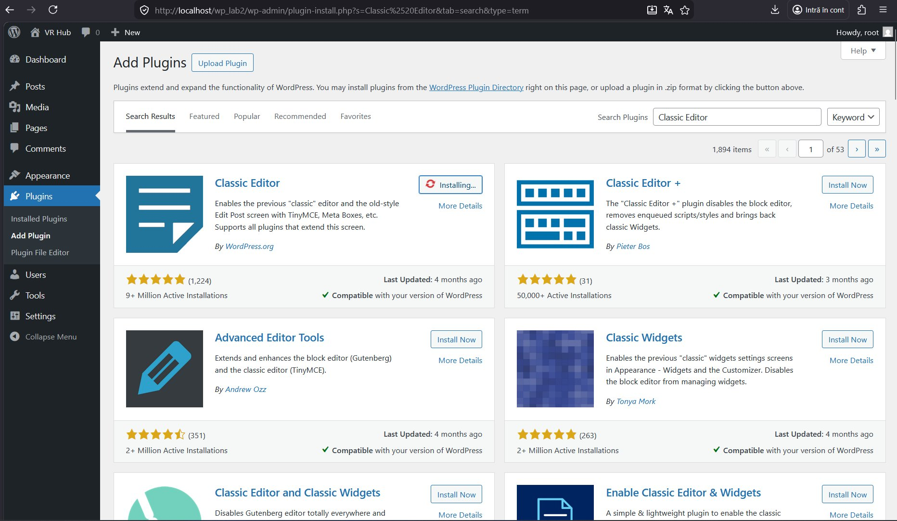

2. **Contact Form 7** — permite crearea de formulare de contact.

### Activarea plugin-urilor

Ambele plugin-uri au fost activate. Confirmarea apare în lista **Plugins → Installed Plugins** (marcate ca active).

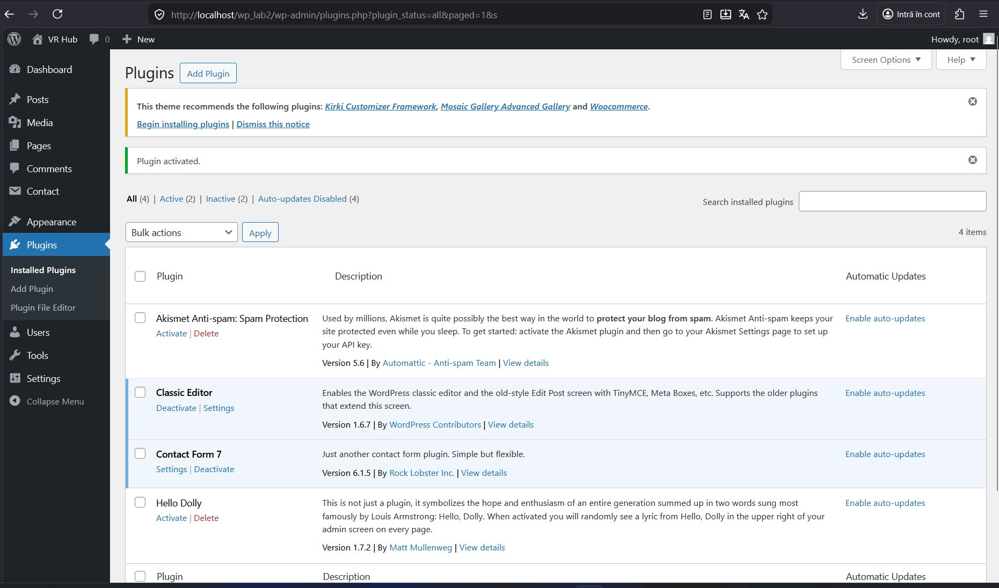

### Testarea funcționalităților

**Classic Editor** — la crearea unei postări noi (**Posts → Add New**), editorul clasic (TinyMCE) este afișat în locul blocurilor Gutenberg.

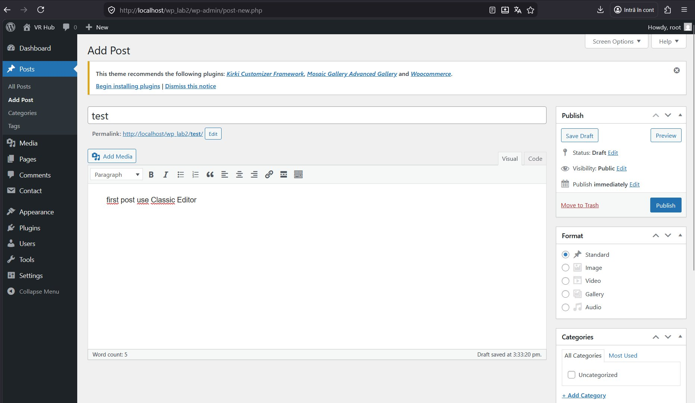

**Contact Form 7** — a fost creat un formular de contact nou numit `test form`.

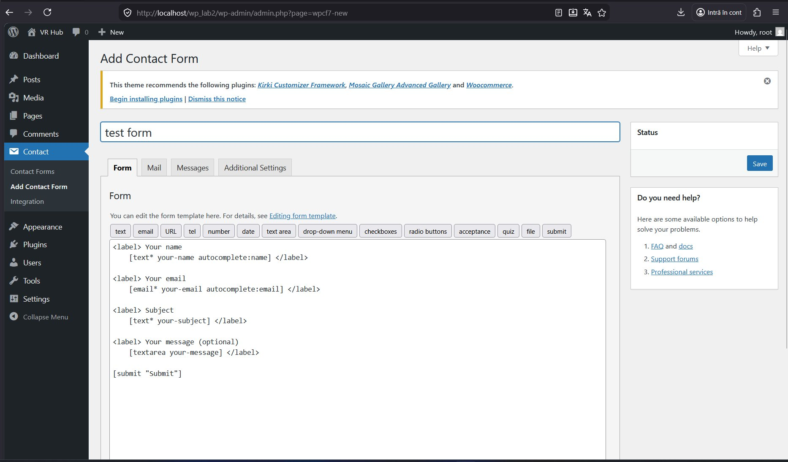

Formularul a fost salvat și a primit shortcode-ul:
```
[contact-form-7 id="0d9045c" title="test form"]
```

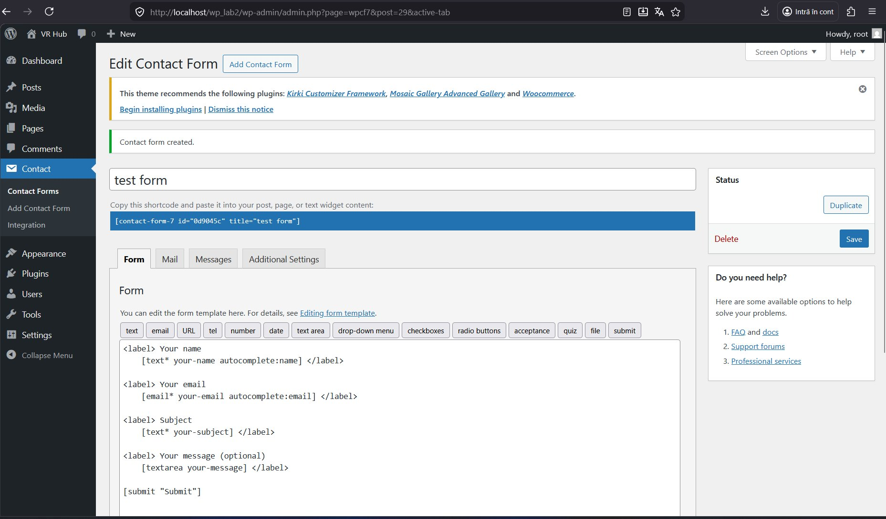

### Dezactivarea unui plugin

Plugin-ul **Contact Form 7** a fost dezactivat din lista de plugin-uri. După dezactivare, meniul **Contact** dispare din panoul de administrare, iar shortcode-ul formularului nu mai funcționează pe site.

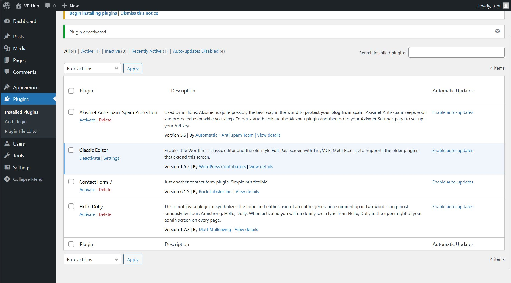

---

## Pasul 6. Crearea de conținut

### Postări pe blog

Au fost create mai multe postări cu conținut diferit:

- **Hello World!** — postarea implicită WordPress, cu 1 comentariu.
- **Test** — postare creată manual cu editorul Classic Editor, conținând textul *„first post use Classic Editor"* și o imagine atașată.

Conținutul este afișat corect pe pagina principală a site-ului, cu imagini, autor, număr de comentarii și link „Read More".

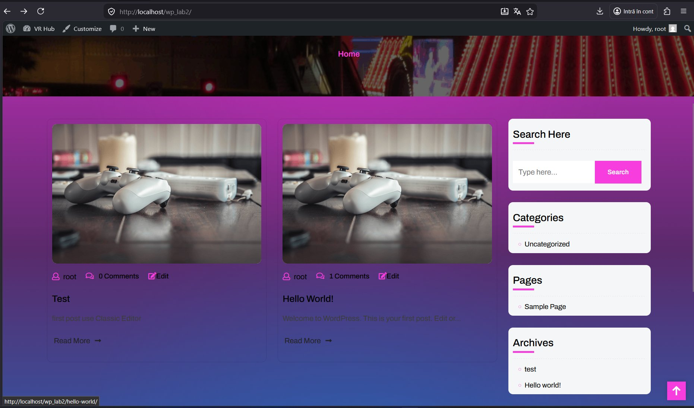

### Pagina „Archive Post"

A fost verificată pagina de arhivă care afișează postările în format grilă cu sidebar.


---

## Întrebări de control

### 1. Ce face o temă în WordPress și ce face un plugin?

**Tema** controlează aspectul vizual al site-ului — layout-ul, culorile, fonturile, structura paginilor. Ea definește *cum arată* site-ul.

**Plugin-ul** extinde funcționalitatea WordPress — adaugă noi caracteristici precum formulare de contact, magazine online, optimizare SEO etc. El definește *ce poate face* site-ul.

### 2. De ce nu se pierde conținutul site-ului atunci când se schimbă tema?

Conținutul (postările, paginile, comentariile, imaginile) este stocat în **baza de date MySQL**, independent de tema activă. Tema influențează doar modul de afișare (prezentarea) a acestor date, nu datele în sine. Prin urmare, schimbarea temei modifică aspectul, dar nu șterge sau alterează conținutul.

### 3. Cum se poate modifica aspectul site-ului fără a edita codul?

WordPress oferă mai multe instrumente vizuale:

- **Appearance → Customize** (Customizer) — permite modificarea logo-ului, culorilor, titlului, widget-urilor și altor setări ale temei în timp real, cu previzualizare live.
- **Appearance → Themes** — instalarea și schimbarea temelor cu un singur click.
- **Appearance → Widgets** — adăugarea și rearanjarea widget-urilor în sidebar și footer.
- **Appearance → Menus** — crearea și editarea meniurilor de navigare.
- **Site Editor** (pentru teme block) — editare vizuală completă a structurii site-ului folosind blocuri.

---

## Concluzie

În cadrul acestei lucrări de laborator a fost instalat și configurat WordPress într-un mediu local (XAMPP). Au fost parcurși toți pașii: crearea bazei de date, instalarea WordPress, configurarea setărilor inițiale, instalarea și personalizarea unei teme, lucrul cu plugin-uri (Classic Editor și Contact Form 7) și crearea de conținut. Lucrarea a demonstrat separarea clară între conținut, aspect și funcționalitate în arhitectura WordPress.
