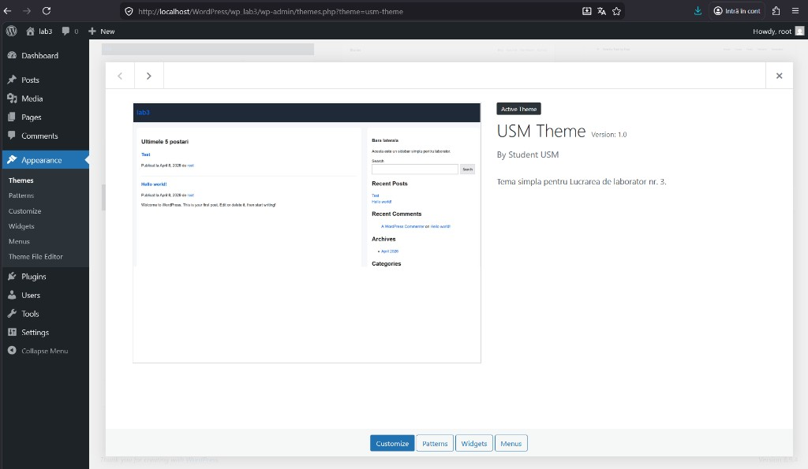
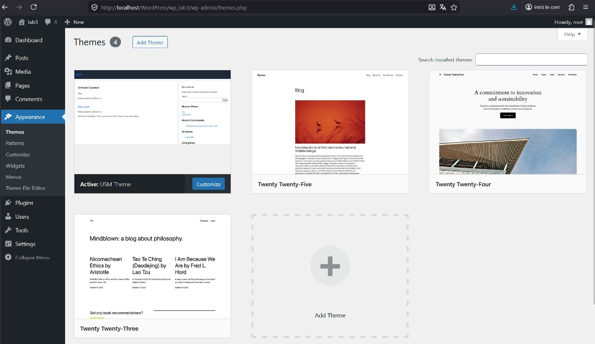
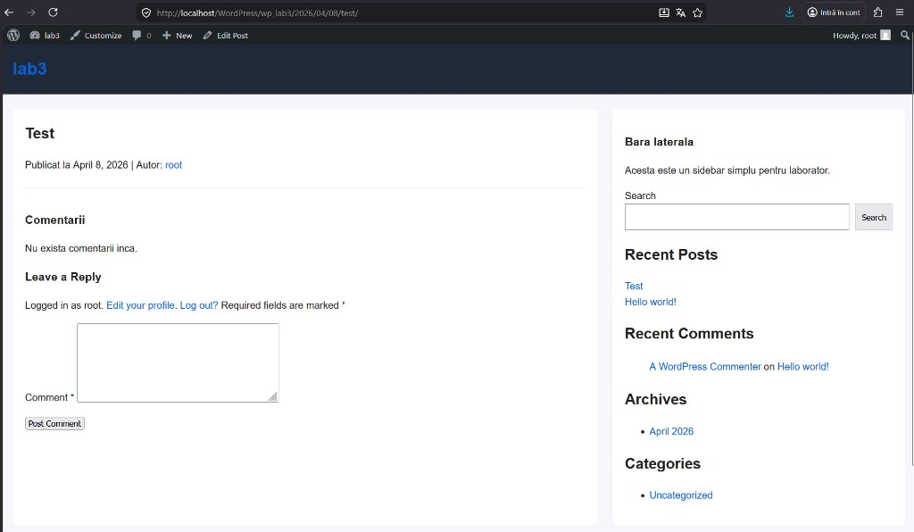

# Lucrarea de laborator nr. 3. Dezvoltarea unei teme WordPress simple

## Scopul lucrarii
Sa invat cum sa creez o tema WordPress personalizata, sa inteleg structura minima a unei teme si principiile de functionare ale sabloanelor.

---

## Pasul 1. Pregatirea mediului

A fost utilizata instalarea WordPress locala din folderul `wp_lab3`.

In `wp-content/themes` a fost creat directorul temei:

- `usm-theme`

In fisierul `wp-config.php` a fost activat modul de depanare:

```php
define( 'WP_DEBUG', true );
```

---

## Pasul 2. Crearea fisierelor obligatorii ale temei

In folderul `wp-content/themes/usm-theme/` au fost create:

- `style.css`
- `index.php`

In `style.css` au fost adaugate metadatele temei si reguli CSS de baza.

In `index.php` a fost adaugata structura principala a paginii si logica de afisare a postarilor.

---

## Pasul 3. Componente comune ale sabloanelor

Au fost create:

- `header.php`
- `footer.php`

In `index.php` au fost incluse cu functiile WordPress:

- `get_header()`
- `get_footer()`

Pe pagina principala sunt afisate ultimele 5 postari, folosind bucla WordPress (`WP_Query`).

---

## Pasul 4. Fisierul de functii

A fost creat fisierul:

- `functions.php`

In acest fisier a fost implementata incarcarea stilurilor temei prin:

- `wp_enqueue_style()`

De asemenea, a fost inregistrat un sidebar pentru widget-uri.

---

## Pasul 5. Sabloane suplimentare

Au fost create fisierele:

- `single.php` - pentru postare individuala
- `page.php` - pentru pagina statica
- `sidebar.php` - pentru bara laterala
- `comments.php` - pentru afisarea comentariilor
- `archive.php` - pentru afisarea arhivelor

Incluziuni folosite:

- `get_sidebar()` in layout-ul principal
- `comments_template()` in `single.php` si `page.php`

---

## Pasul 6. Stilizarea temei

In `style.css` au fost stilizate:

- antetul (`.site-header`)
- continutul principal (`.main-content`)
- bara laterala (`.sidebar`)
- subsolul (`.site-footer`)

Layout-ul este responsive pentru ecrane mici.

---

## Pasul 7. Captura de ecran a temei

In folderul temei a fost adaugat:

- `screenshot.png` (1200x900px)

Acest fisier este folosit de WordPress pentru preview in `Appearance -> Themes`.

Preview tema in detalii:



---

## Pasul 8. Activarea temei

Tema a fost activata din:

- `Appearance -> Themes`

Au fost verificate:

- pagina principala (lista postari)
- postare individuala (`single.php`) + comentarii
- pagina statica (`page.php`) + comentarii
- arhiva (`archive.php`)

Tema activata in lista de teme:



Testare postare individuala (`single.php`):



---

## Structura finala a temei

`wp-content/themes/usm-theme/`

- `style.css`
- `functions.php`
- `index.php`
- `header.php`
- `footer.php`
- `sidebar.php`
- `single.php`
- `page.php`
- `comments.php`
- `archive.php`
- `screenshot.png`

---

## Codul sursa realizat in cadrul laboratorului

### `style.css`
```css
/*
Theme Name: USM Theme
Theme URI: http://localhost/wp_lab3
Author: Student USM
Description: Tema simpla pentru Lucrarea de laborator nr. 3.
Version: 1.0
Text Domain: usm-theme
*/

* {
  box-sizing: border-box;
}

body {
  margin: 0;
  font-family: Arial, sans-serif;
  line-height: 1.6;
  background: #f5f7fb;
  color: #222;
}

a {
  color: #0b5ed7;
  text-decoration: none;
}

a:hover {
  text-decoration: underline;
}

.site-header {
  background: #1f2937;
  color: #fff;
  padding: 16px 0;
}

.container {
  width: 100%;
  max-width: none;
  margin: 0;
  padding: 0 16px;
}

.site-title {
  margin: 0;
  font-size: 28px;
}

.site-description {
  margin: 4px 0 0;
  color: #d1d5db;
}

.content-wrap {
  display: grid;
  grid-template-columns: 2fr 1fr;
  gap: 24px;
  margin: 24px 0;
}

.main-content,
.sidebar {
  background: #fff;
  border-radius: 8px;
  padding: 20px;
}

.post-card {
  margin-bottom: 20px;
  padding-bottom: 16px;
  border-bottom: 1px solid #e5e7eb;
}

.post-card:last-child {
  border-bottom: 0;
  margin-bottom: 0;
}

.site-footer {
  background: #111827;
  color: #e5e7eb;
  padding: 18px 0;
  margin-top: 24px;
}

.archive-title,
.single-title,
.page-title {
  margin-top: 0;
}

.comments-area {
  margin-top: 24px;
  padding-top: 18px;
  border-top: 1px solid #e5e7eb;
}

@media (max-width: 860px) {
  .content-wrap {
    grid-template-columns: 1fr;
  }
}
```

### `functions.php`
```php
<?php
/**
 * Functiile de baza ale temei USM.
 */

function usm_theme_enqueue_assets() {
    wp_enqueue_style(
        'usm-theme-style',
        get_stylesheet_uri(),
        array(),
        wp_get_theme()->get('Version')
    );
}
add_action('wp_enqueue_scripts', 'usm_theme_enqueue_assets');

function usm_theme_register_sidebar() {
    register_sidebar(
        array(
            'name'          => 'Primary Sidebar',
            'id'            => 'primary-sidebar',
            'description'   => 'Sidebar principal pentru tema USM.',
            'before_widget' => '<section class="widget">',
            'after_widget'  => '</section>',
            'before_title'  => '<h4 class="widget-title">',
            'after_title'   => '</h4>',
        )
    );
}
add_action('widgets_init', 'usm_theme_register_sidebar');
```

### `index.php`
```php
<?php get_header(); ?>

<h2>Ultimele 5 postari</h2>

<?php
$latest_posts = new WP_Query(
    array(
        'posts_per_page' => 5,
        'post_status'    => 'publish',
    )
);
?>

<?php if ($latest_posts->have_posts()) : ?>
    <?php while ($latest_posts->have_posts()) : $latest_posts->the_post(); ?>
        <article class="post-card">
            <h3><a href="<?php the_permalink(); ?>"><?php the_title(); ?></a></h3>
            <p>
                Publicat la <?php echo esc_html(get_the_date()); ?> de
                <?php the_author_posts_link(); ?>
            </p>
            <?php the_excerpt(); ?>
        </article>
    <?php endwhile; ?>
    <?php wp_reset_postdata(); ?>
<?php else : ?>
    <p>Nu exista postari momentan.</p>
<?php endif; ?>

<?php get_footer(); ?>
```

### `header.php`
```php
<!DOCTYPE html>
<html <?php language_attributes(); ?>>
<head>
    <meta charset="<?php bloginfo('charset'); ?>">
    <meta name="viewport" content="width=device-width, initial-scale=1">
    <?php wp_head(); ?>
</head>
<body <?php body_class(); ?>>
<?php wp_body_open(); ?>

<header class="site-header">
    <div class="container">
        <h1 class="site-title">
            <a href="<?php echo esc_url(home_url('/')); ?>">
                <?php bloginfo('name'); ?>
            </a>
        </h1>
        <p class="site-description"><?php bloginfo('description'); ?></p>
    </div>
</header>

<div class="container content-wrap">
    <main class="main-content">
```

### `footer.php`
```php
    </main>

    <?php get_sidebar(); ?>
</div>

<footer class="site-footer">
    <div class="container">
        <p>&copy; <?php echo esc_html(date_i18n('Y')); ?> <?php bloginfo('name'); ?>. Toate drepturile rezervate.</p>
    </div>
</footer>

<?php wp_footer(); ?>
</body>
</html>
```

### `sidebar.php`
```php
<aside class="sidebar">
    <h3>Bara laterala</h3>
    <p>Acesta este un sidebar simplu pentru laborator.</p>

    <?php if (is_active_sidebar('primary-sidebar')) : ?>
        <?php dynamic_sidebar('primary-sidebar'); ?>
    <?php else : ?>
        <ul>
            <li><a href="<?php echo esc_url(home_url('/')); ?>">Acasa</a></li>
            <li><a href="<?php echo esc_url(home_url('/about')); ?>">Despre</a></li>
        </ul>
    <?php endif; ?>
</aside>
```

### `single.php`
```php
<?php get_header(); ?>

<?php if (have_posts()) : ?>
    <?php while (have_posts()) : the_post(); ?>
        <article>
            <h2 class="single-title"><?php the_title(); ?></h2>
            <p>
                Publicat la <?php echo esc_html(get_the_date()); ?> |
                Autor: <?php the_author_posts_link(); ?>
            </p>
            <?php the_content(); ?>
        </article>

        <?php comments_template(); ?>
    <?php endwhile; ?>
<?php else : ?>
    <p>Postarea nu a fost gasita.</p>
<?php endif; ?>

<?php get_footer(); ?>
```

### `page.php`
```php
<?php get_header(); ?>

<?php if (have_posts()) : ?>
    <?php while (have_posts()) : the_post(); ?>
        <article>
            <h2 class="page-title"><?php the_title(); ?></h2>
            <?php the_content(); ?>
        </article>

        <?php comments_template(); ?>
    <?php endwhile; ?>
<?php else : ?>
    <p>Pagina nu a fost gasita.</p>
<?php endif; ?>

<?php get_footer(); ?>
```

### `comments.php`
```php
<?php if (post_password_required()) : ?>
    <p>Aceasta postare este protejata cu parola.</p>
    <?php return; ?>
<?php endif; ?>

<section class="comments-area">
    <h3>Comentarii</h3>

    <?php if (have_comments()) : ?>
        <ol>
            <?php wp_list_comments(); ?>
        </ol>
    <?php else : ?>
        <p>Nu exista comentarii inca.</p>
    <?php endif; ?>

    <?php comment_form(); ?>
</section>
```

### `archive.php`
```php
<?php get_header(); ?>

<h2 class="archive-title"><?php the_archive_title(); ?></h2>
<?php the_archive_description('<div>', '</div>'); ?>

<?php if (have_posts()) : ?>
    <?php while (have_posts()) : the_post(); ?>
        <article class="post-card">
            <h3><a href="<?php the_permalink(); ?>"><?php the_title(); ?></a></h3>
            <p><?php echo esc_html(get_the_date()); ?></p>
            <?php the_excerpt(); ?>
        </article>
    <?php endwhile; ?>

    <?php the_posts_pagination(); ?>
<?php else : ?>
    <p>Nu exista postari in aceasta arhiva.</p>
<?php endif; ?>

<?php get_footer(); ?>
```

---

## Intrebari de control

### 1. Care sunt cele doua fisiere obligatorii pentru orice tema WordPress?
- `style.css`
- `index.php`

### 2. Cum se includ partile comune ale sabloanelor (header, footer, sidebar)?
Prin functiile:

```php
<?php get_header(); ?>
<?php get_footer(); ?>
<?php get_sidebar(); ?>
<?php comments_template(); ?>
```

### 3. Care este diferenta dintre `index.php`, `single.php` si `page.php`?
- `index.php` - sablon principal (fallback)
- `single.php` - afisarea unei postari individuale
- `page.php` - afisarea unei pagini statice

### 4. Care este rolul fisierului `functions.php` intr-o tema?
`functions.php` adauga functionalitati temei: incarcarea stilurilor/scripturilor, inregistrarea sidebar-urilor, hook-uri WordPress si alte configurari.

---

## Concluzie

In cadrul lucrarii a fost dezvoltata o tema WordPress simpla si functionala (`usm-theme`), respectand toate conditiile laboratorului: structura minima a temei, componente comune reutilizabile, sabloane suplimentare, comentarii, arhive, stilizare de baza si activarea in panoul de administrare WordPress.