# Lucrarea de laborator nr. 5 — Securitatea WordPress

> **Scopul lucrării:** Consolidarea celor mai importante practici de securitate în WordPress: gestionarea rolurilor și parolelor, actualizări, hardening de bază (`wp-config.php`, permisiuni, dezactivarea editorului), backup, monitorizarea activității și configurarea pas cu pas a **All In One WP Security & Firewall (AIOS)** pentru protecție împotriva atacurilor brute-force, WAF de bază și controlul permisiunilor.

---

## Cuprins

1. [Pasul 1 – Pregătirea mediului](#pasul-1--pregătirea-mediului)
2. [Pasul 2 – Gestionarea rolurilor și parolelor](#pasul-2--gestionarea-rolurilor-și-parolelor)
3. [Pasul 3 – Actualizări](#pasul-3--actualizări)
4. [Pasul 4 – Hardening de bază](#pasul-4--hardening-de-bază)
5. [Pasul 5 – Instalarea și configurarea AIOS](#pasul-5--instalarea-și-configurarea-aios)
6. [Întrebări de control](#întrebări-de-control)

---

## Pasul 1 – Pregătirea mediului

Instalarea WordPress locală rulează la adresa `http://localhost/WordPress/wp_lab5/wp-admin/`.  
S-a activat modul de depanare în `wp-config.php`:

```php
define('WP_DEBUG', true);
```

> Această directivă activează afișarea erorilor PHP în timp ce se lucrează local, facilitând depistarea problemelor de configurare.

---

## Pasul 2 – Gestionarea rolurilor și parolelor

### 2.1 Crearea utilizatorului de test (rol: Autor)

Din meniul **New → User** din bara de administrare s-a creat un utilizator nou.

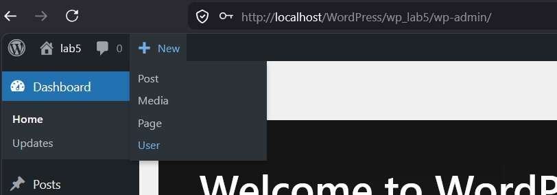

Formularul **Add User** a fost completat cu:

| Câmp | Valoare |
|------|---------|
| Username | `autor` |
| Email | `autor@gmail.com` |
| Role | **Author** |
| Password | generată automat — **Strong** |

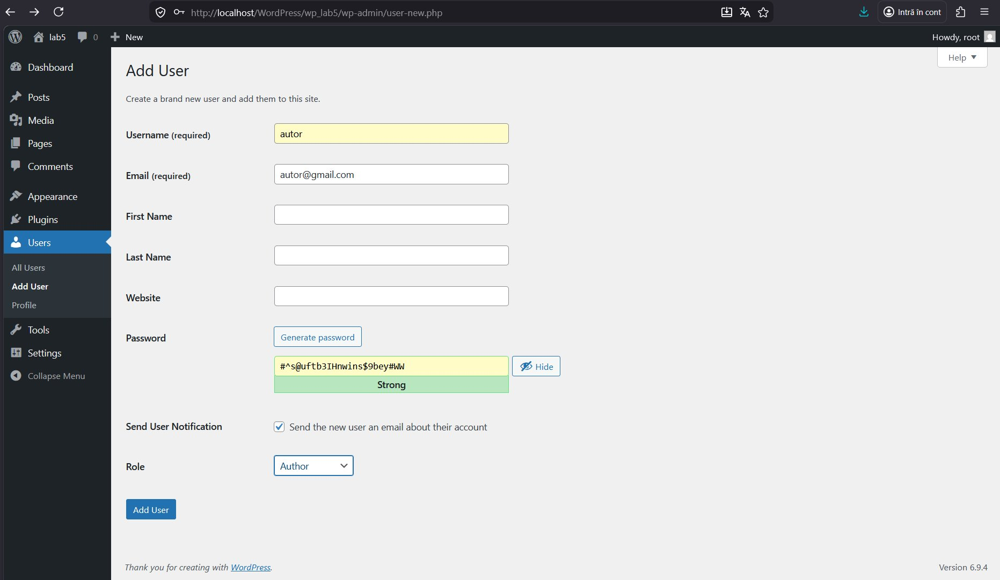

După salvare, lista utilizatorilor conține acum 2 conturi: `autor` (Author) și `root` (Administrator).

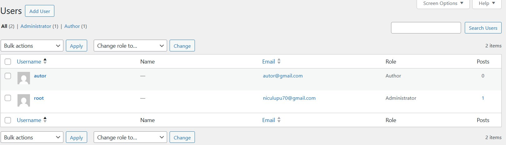

### 2.2 Verificarea parolei administratorului

Parola contului `root` a fost regenerată prin **Profile → Set New Password**. WordPress a confirmat rezistența **Strong**.

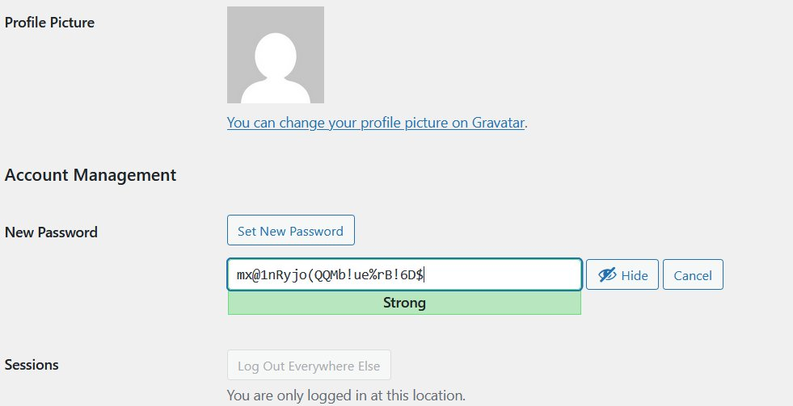

---

## Pasul 3 – Actualizări

S-a accesat **Dashboard → Updates**. WordPress rulează la versiunea **6.9.4** (cea mai recentă disponibilă), toate plugin-urile și temele sunt la zi.

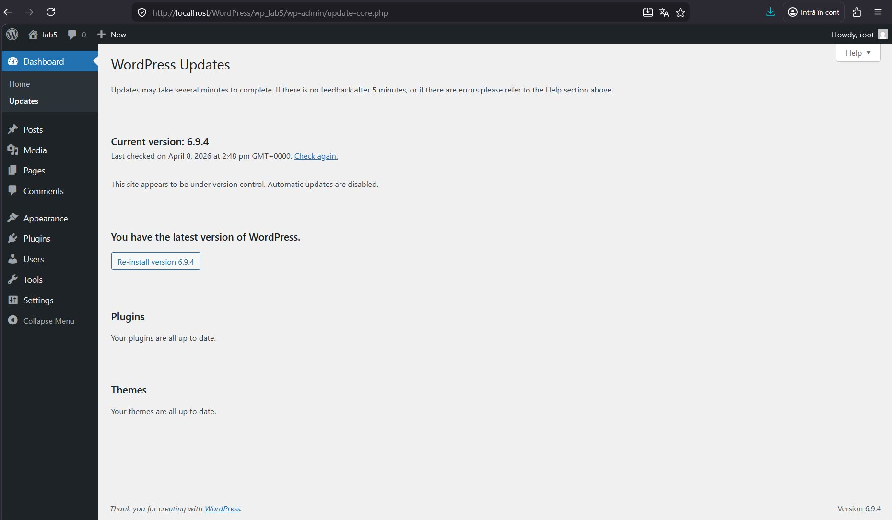

### 3.1 Actualizări automate pentru teme

Tema activă **Twenty Twenty-Five** (v1.4) a fost configurată cu actualizări automate activate (link „Disable auto-updates" vizibil → actualizările automate sunt **ON**).

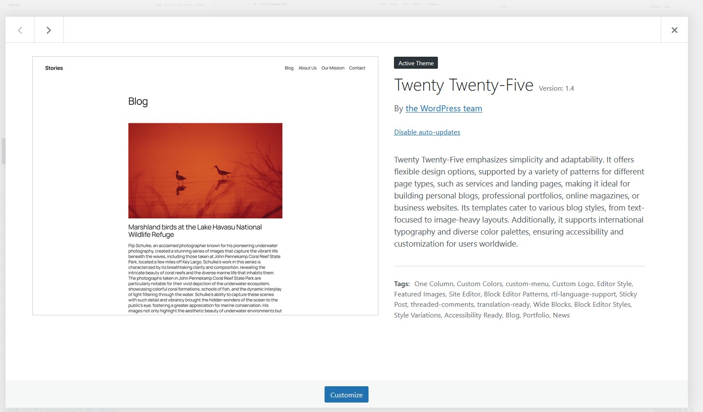

---

## Pasul 4 – Hardening de bază

### 4.1 Dezactivarea editorului de fișiere

S-a adăugat în `wp-config.php`:

```php
define('WP_DEBUG', true);
define('DISALLOW_FILE_EDIT', true);
```

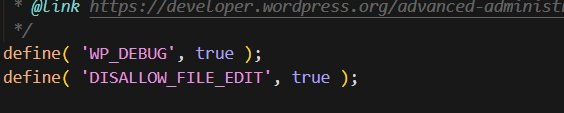

Această directivă elimină meniurile **Appearance → Theme File Editor** și **Plugins → Plugin File Editor** din panoul de administrare, împiedicând un atacator care obține acces la admin să modifice direct codul PHP.

### 4.2 Protecția `wp-config.php` prin `.htaccess`

S-a adăugat în `.htaccess` blocul de restricție:

```apache
<Files wp-config.php>
   order allow,deny
   deny from all
</Files>
```

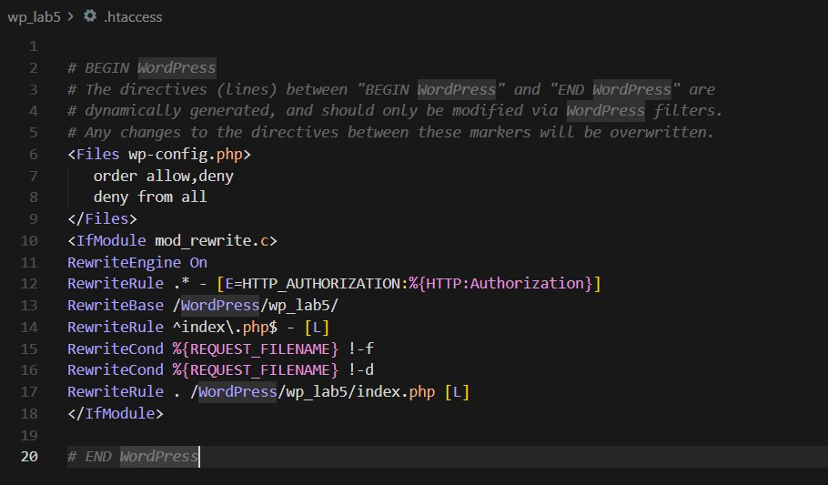

Această regulă face ca serverul Apache să returneze **403 Forbidden** la orice cerere HTTP directă către `wp-config.php`, indiferent de originea cererii.

### 4.3 Permisiuni fișiere și foldere

Permisiunile recomandate aplicate:

| Tip | Octal |
|-----|-------|
| Foldere | `755` |
| Fișiere | `644` |
| `wp-config.php` | `600` (recomandat, restricție suplimentară) |

> Pe instalarea Windows/localhost verificarea prin AIOS a returnat mesajul „not applicable for Windows server" (vezi [Pasul 5 – File Security](#file-security)).

---

## Pasul 5 – Instalarea și configurarea AIOS

### Instalarea plugin-ului

Plugin-ul **All-In-One Security (AIOS)** a fost căutat și instalat direct din **Plugins → Add Plugin**.

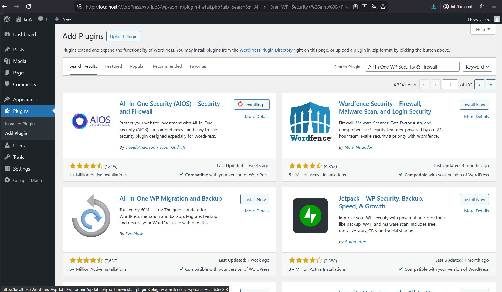

La prima activare se afișează wizard-ul de bun venit.

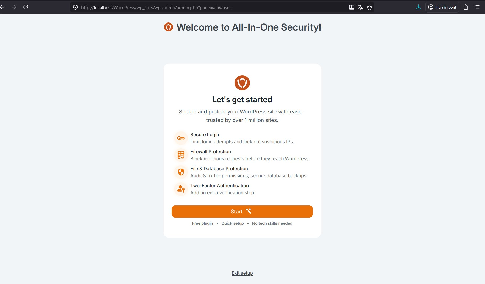

### Dashboard AIOS

După configurare, scorul de securitate inițial este **150 / 585 puncte**. Banner-ul confirmă că firewall-ul a fost instalat la nivelul cel mai înalt de protecție.

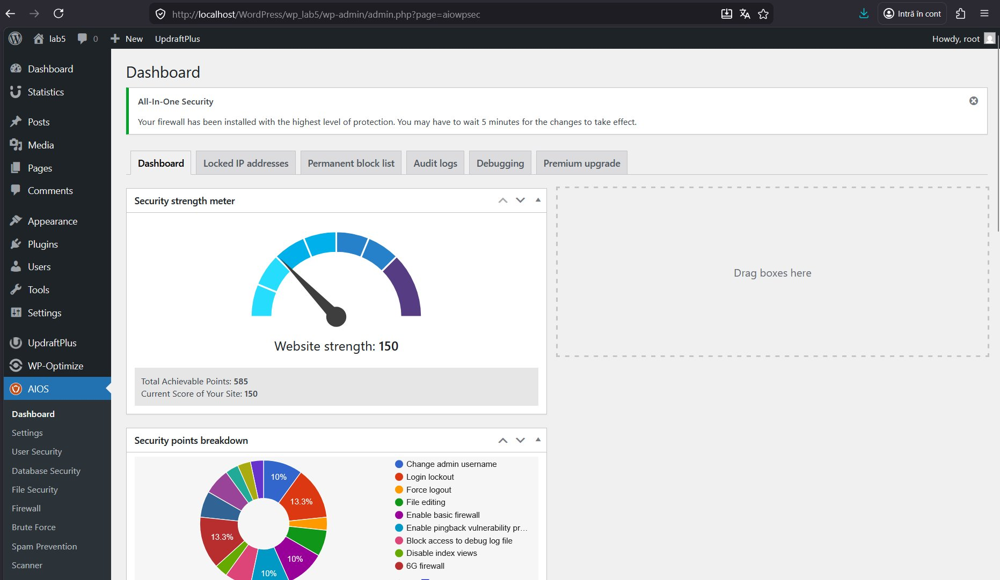

---

### Login Lockout

**AIOS → User Security → Login lockout**

| Parametru | Valoare setată | Justificare |
|-----------|---------------|-------------|
| Enable login lockout | ✅ ON | Activează mecanismul principal anti-brute-force |
| Allow unlock requests | ✅ ON | Permite utilizatorilor legitimi să se deblocheze singuri |
| Max login attempts | **5** | 5 încercări sunt suficiente pentru un utilizator real; mai puține cresc riscul de auto-blocare |
| Login retry time period | **15 min** | Fereastra de monitorizare a tentativelor |
| Min lockout time | **30 min** | Descurajează atacurile automate fără a bloca permanent utilizatorii legitimi |
| Max lockout time | **30 min** | Limită superioară uniformă pentru testare |

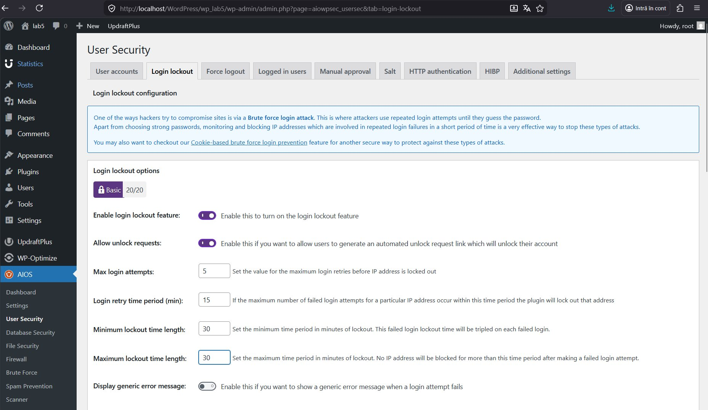

---

### Force Logout

**AIOS → User Security → Force logout**

Sesiunile de administrare expiră automat după **1440 minute (24 ore)**, eliminând riscul sesiunilor „eterne" lăsate deschise.

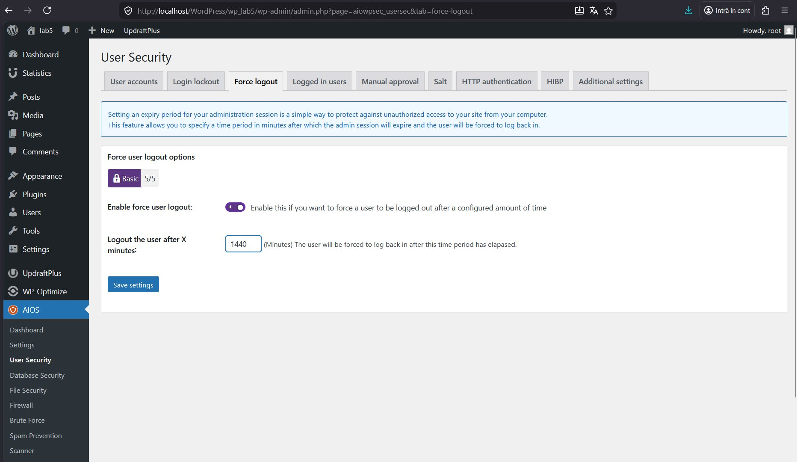

---

### User Accounts — Verificare username „admin"

**AIOS → User Security → User accounts**

AIOS a scanat lista administratorilor. Contul de administrator are username-ul `root` (nu `admin`), deci nu este necesară redenumirea.

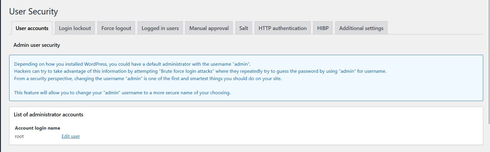

---

### Manual Approval (Înregistrare utilizatori)

**AIOS → User Security → Manual approval**

A fost activată aprobarea manuală a noilor înregistrări. Orice cont nou creat prin formularul de înregistrare va rămâne în stare **pending** până la aprobarea explicită de către administrator.

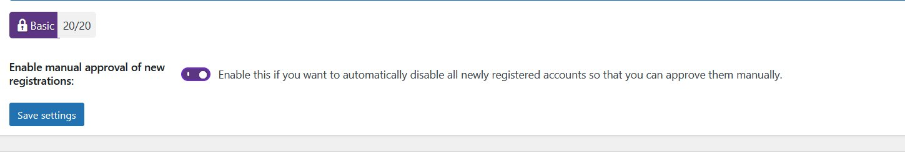

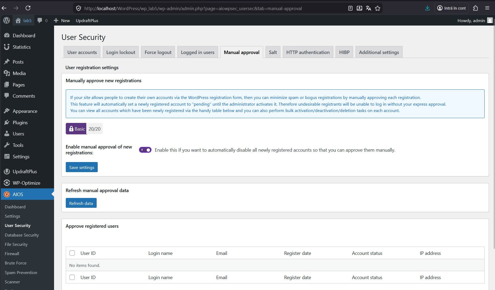

---

### File Security — File Permissions

**AIOS → File Security → File permissions**

Pe instalarea locală Windows, scanarea permisiunilor Unix nu se aplică. AIOS afișează mesajul informativ:

> *This plugin has detected that your site is running on a Windows server. This feature is not applicable for Windows server installations.*

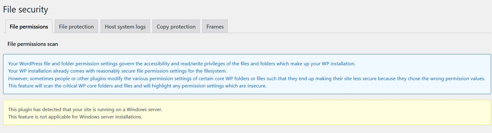

Pe un server Linux, această secțiune identifică folderele/fișierele cu permisiuni prea permisive și oferă butonul „Fix" pentru corectare automată.

---

### Firewall — Basic Firewall

**AIOS → Firewall → .htaccess rules → Basic firewall settings**

Firewall-ul de bază a fost activat (scor **15/15**). Aceasta adaugă reguli în `.htaccess` care blochează accesul la fișierele de sistem WordPress, limitează dimensiunea upload-urilor la 100 MB și protejează directoarele sensibile.

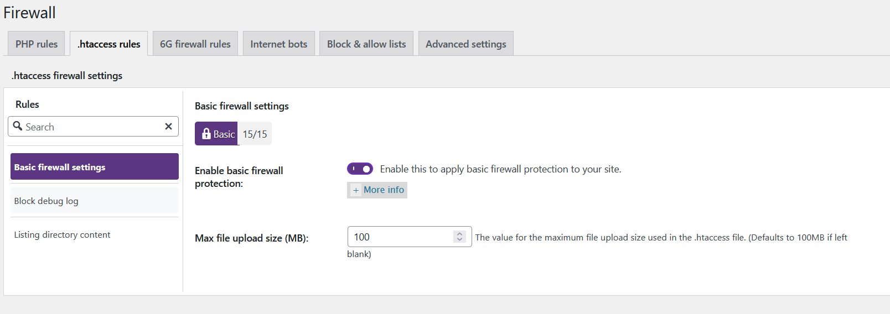

### Firewall — XSS / String Filtering

**AIOS → Firewall → PHP rules → String filtering**

Filtrul avansat de șiruri de caractere a fost activat (scor **Advanced 15/15**). Acesta blochează secvențele de caractere care seamănă cu atacuri XSS înainte ca cererea să ajungă la WordPress.

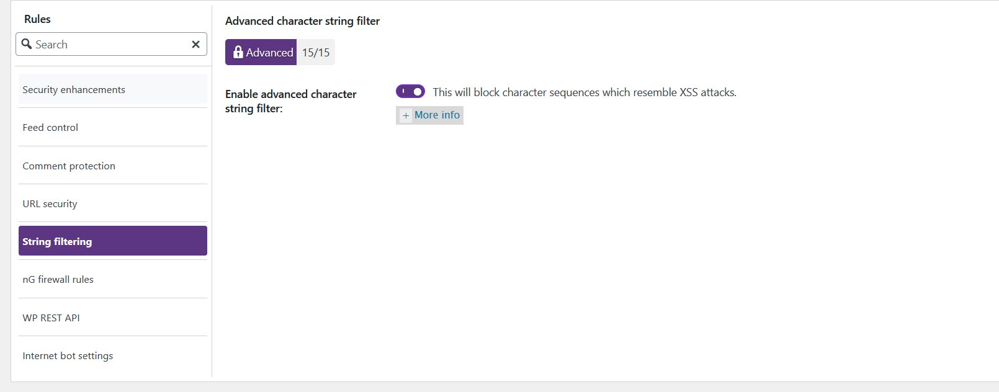

---

### Brute Force — Rename Login Page

**AIOS → Brute Force → Rename login page**

URL-ul de autentificare a fost schimbat de la `/wp-login.php` la `/root`, astfel că adresa completă de login devine:

```
http://localhost/WordPress/wp_lab5/root
```

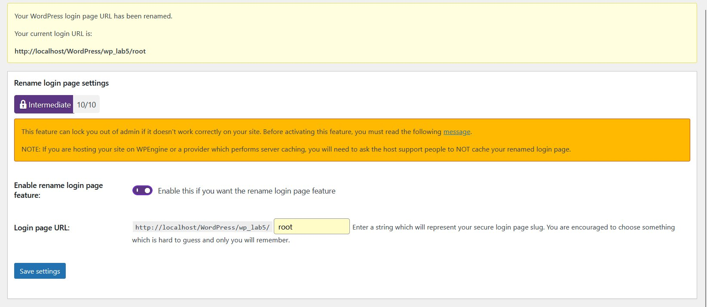

> ⚠️ Noul URL a fost salvat în managerul de parole. Accesarea vechii adrese `/wp-login.php` returnează 404.

---

### Scanner — File Change Detection

**AIOS → Scanner → File change detection**

Scanarea automată a modificărilor de fișiere a fost activată cu următorii parametri:

| Parametru | Valoare |
|-----------|---------|
| Automated scan | ✅ ON |
| Scan interval | 4 săptămâni |
| Send email on change | ✅ ON → `niculupu70@gmail.com` |

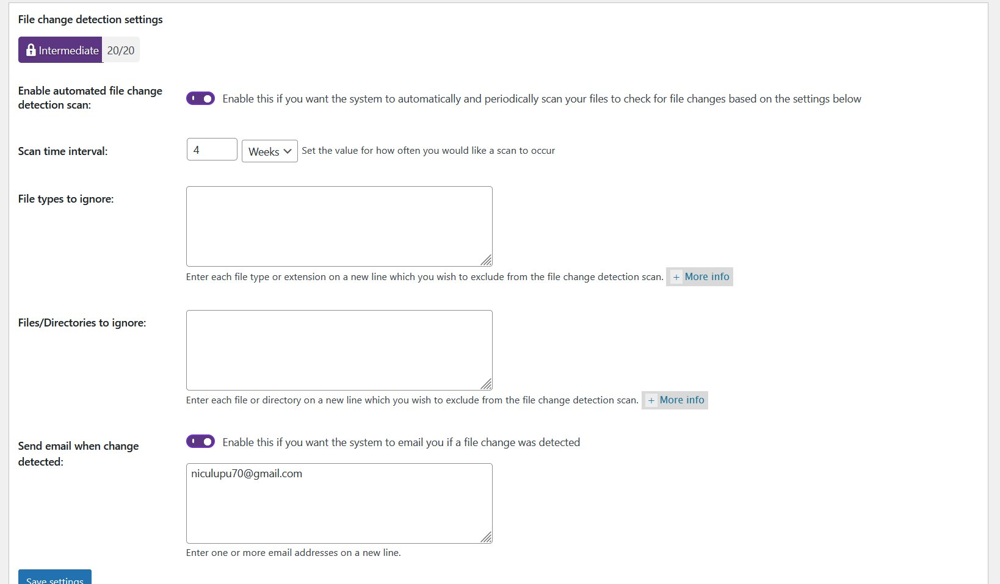

---

### Backup — UpdraftPlus

**UpdraftPlus → Backup/Restore**

A fost creat primul backup al bazei de date la **Apr 08, 2026 15:18**. Backup-ul conține snapshot-ul complet al bazei de date WordPress.

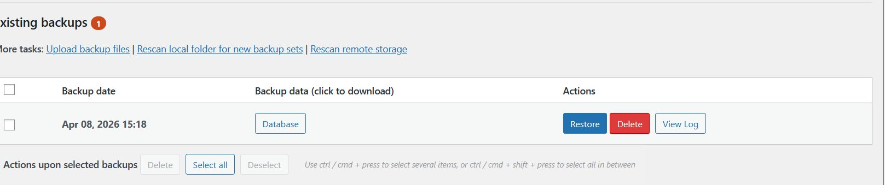

---

## Pasul 6 – Testarea protecției brute-force

### 6.1 Starea site-ului înainte de test

Site-ul conținea postările „test backup" și „Hello world!" vizibile pe frontend.

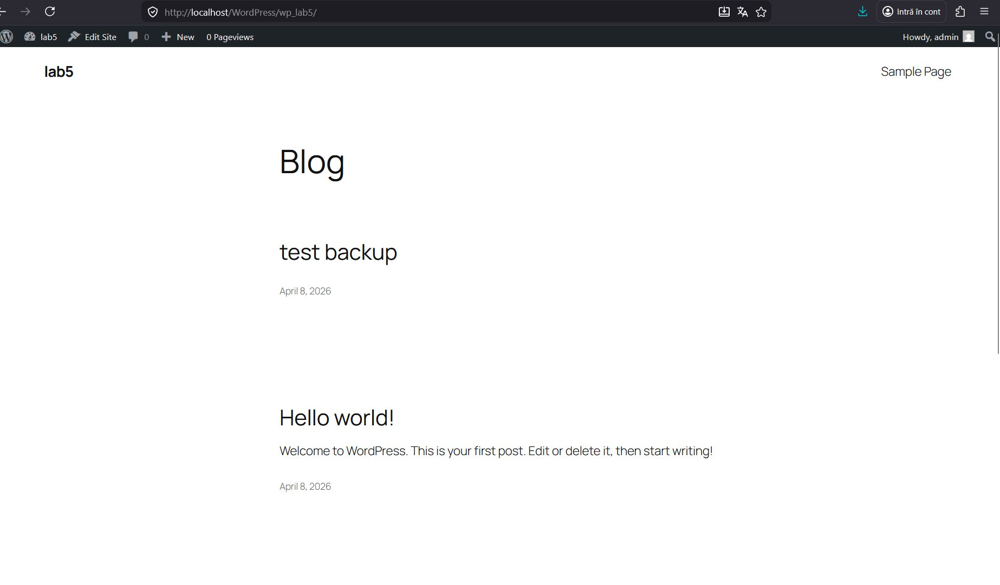

### 6.2 Tentative repetate de autentificare eșuată

S-a accesat noul URL de login (`/root`) și s-au introdus parole greșite de 5–6 ori consecutiv pentru utilizatorul `root`.

### 6.3 Activarea lockdown-ului

După depășirea pragului de 5 tentative eșuate, AIOS a blocat adresa IPv6 a clientului. Pagina de login afișează mesajul de blocare cu opțiunea de auto-deblocare:

> **ERROR:** Access from your IP address has been blocked for security reasons. Please contact the administrator.

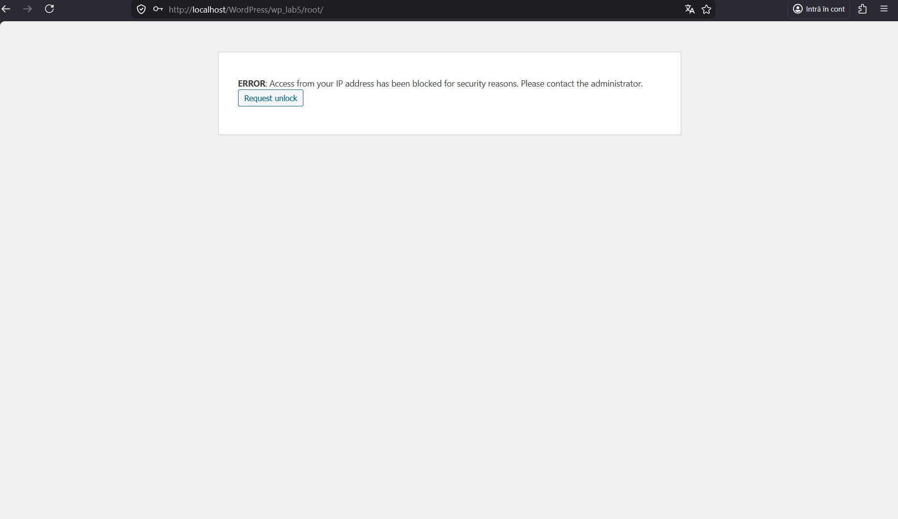

### 6.4 Înregistrarea în AIOS Dashboard — Locked IP addresses

AIOS a înregistrat blocarea în **Dashboard → Locked IP addresses**:

| Câmp | Valoare |
|------|---------|
| Locked IP | `2a00:1858:1055:82f2:a581:53e2:32a4:b8a2` |
| User ID | 1 |
| Username | root |
| Reason | `too_many_failed_logins` |
| Date locked | April 8, 2026 3:25 pm |
| Release date | April 8, 2026 4:25 pm |

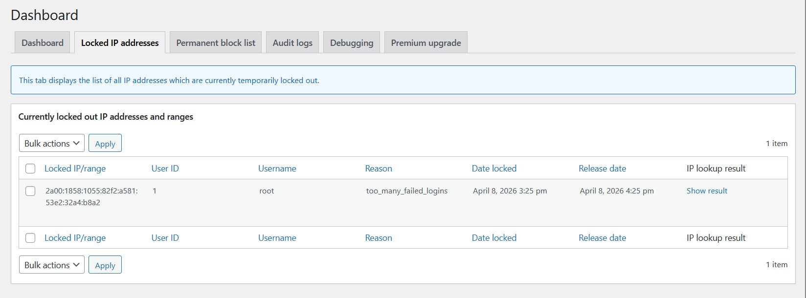

Blocarea s-a eliberat automat după 30 de minute (conform setărilor din Pasul 5).

---

## Pasul 7 – Restaurarea din backup

### 7.1 Al doilea backup și ștergerea postărilor

Înainte de testul de restaurare, s-a creat un al doilea backup la **Apr 08, 2026 15:20** (după adăugarea postării „test backup"). Lista de backup-uri conține acum 2 intrări.

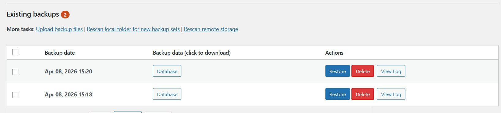

Ambele postări („test backup" și „Hello world!") au fost șterse permanent din WordPress.

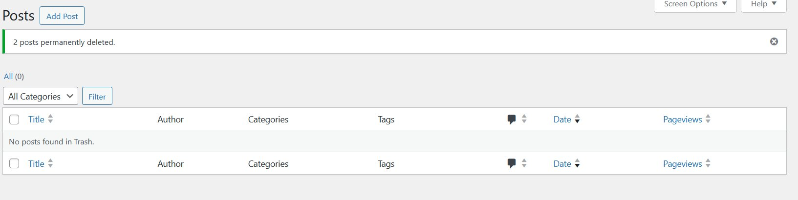

### 7.2 Restaurarea din backup

S-a selectat backup-ul din **Apr 08, 2026 15:20** → buton **Restore** → componenta **Database** bifată.

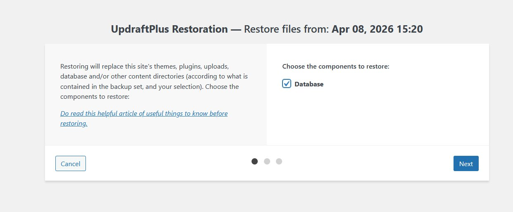

Procesul de restaurare s-a finalizat cu succes:

> **Restore successful!**  
> Finished: lines processed: 102 in 1.15 seconds

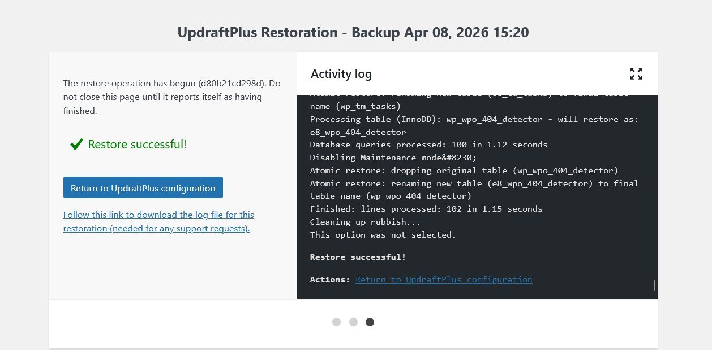

### 7.3 Verificarea integrității datelor

După restaurare, lista de postări conține din nou ambele articole: **test backup** și **Hello world!** — confirmare că backup-ul și restaurarea au funcționat corect.

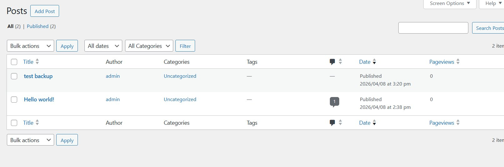

---

## Întrebări de control

### 1. De ce `DISALLOW_FILE_EDIT` și permisiunile corecte pe `wp-config.php` reduc semnificativ riscul post-exploit?

`DISALLOW_FILE_EDIT` elimină editorul de fișiere din panoul de administrare, astfel că un atacator care obține acces la cont de admin **nu poate modifica direct codul PHP** al temelor sau plugin-urilor prin interfața web — ar necesita acces la sistemul de fișiere prin FTP/SSH sau o altă vulnerabilitate separată.

Permisiunile restrictive pe `wp-config.php` (`644` sau mai bine `600`) împiedică procesele web sau alți utilizatori de sistem să **citească credențialele bazei de date** (DB_NAME, DB_USER, DB_PASSWORD, AUTH_KEY-urile). Dacă un fișier PHP arbitrar este executat printr-o vulnerabilitate RFI/LFI, nu va putea include `wp-config.php` dacă permisiunile sunt corecte. Blocul `.htaccess` adaugă un strat suplimentar la nivel HTTP, respingând cererile directe de browser.

Împreună, aceste măsuri îngreunează **pivotarea** după un exploit parțial: compromiterea unui singur vector nu duce automat la compromiterea întregului site.

---

### 2. Ce setări ai ales pentru Login Lockdown/Firewall și de ce?

**Login Lockdown:** Am ales **5 încercări / fereastră de 15 min / blocare 30 min**.

- 5 tentative reprezintă un echilibru rezonabil: un utilizator legitim care uită parola are suficiente șanse fără a oferi atacatorilor un număr mare de guess-uri.
- Fereastra de 15 minute limitează rata atacurilor distribuite în timp.
- Blocarea 30 de minute descurajează reluarea rapidă a atacului, fără a fi atât de lungă încât să afecteze serios utilizatorii reali (care pot folosi funcția „Allow unlock requests" sau îi pot contacta pe administratori).
- **Activarea „Allow unlock requests"** menține experiența utilizatorului acceptabilă — un utilizator blocat accidental poate genera un link de deblocare fără intervenția admin.

**Firewall (Basic):** Nivelul de bază activează regulile `.htaccess` pentru blocarea bad query strings, XSS și directory browsing — măsuri cu impact minim asupra performanței și compatibilității, dar care elimină categorii largi de atacuri automate.

---

### 3. Cu ce se deosebesc măsurile de protecție la nivel WordPress față de cele la nivelul serverului web și al sistemului de operare?

| Nivel | Mecanism | Avantaje | Limitări |
|-------|----------|----------|----------|
| **WordPress / Plugin** | AIOS, .htaccess generat, `wp-config.php` | Ușor de configurat prin UI, specific aplicației, cunoaște logica WordPress (roluri, sesiuni) | Se execută după ce PHP a pornit; vulnerabilitățile în WordPress însuși sau PHP le pot ocoli |
| **Server web (Apache/Nginx)** | `mod_security`, reguli `.htaccess`, rate limiting | Filtrează înainte ca PHP să fie invocat; mai eficient pentru volumuri mari de trafic | Necesită acces la configurația serverului; mai complex de configurat |
| **Sistem de operare** | Permisiuni Unix, firewall de OS (iptables/ufw), fail2ban | Strat fundamental, independent de aplicație; blochează la nivel de pachet TCP/IP | Necesită acces root/sudo; nu înțelege logica aplicației |

Concluzie: măsurile WordPress sunt complementare, nu înlocuiesc nivelurile inferioare. Securitatea optimă aplică principiul **defense in depth** — fiecare strat compensează limitările celuilalt.

---

### 4. Ce trebuie inclus într-un backup „complet" WordPress și cum verifici restaurarea?

Un backup complet WordPress include:

1. **Baza de date** (export SQL complet) — conține postări, pagini, comentarii, opțiuni, utilizatori.
2. **Directorul `wp-content/`** — teme, plugin-uri, upload-uri (imagini, fișiere media).
3. **`wp-config.php`** — credențiale DB și chei de securitate (stocat separat, criptat).
4. **`.htaccess`** — reguli de rewrite și securitate personalizate.

**Verificarea restaurării** se face prin:
- Importul SQL într-o instalare fresh și accesarea frontend-ului/admin-ului.
- Confirmarea că postările, imaginile și setările pluginurilor există (nu doar că baza de date s-a importat fără erori SQL).
- Verificarea că imaginile din Media Library se afișează corect (fișierele fizice din `wp-content/uploads/` trebuie să corespundă înregistrărilor din baza de date).
- Testarea unui utilizator de test pentru autentificare.

Un backup fără un test de restaurare nu este un backup real — este doar o speranță.

---

*Lucrare realizată pe WordPress 6.9.4 · All In One WP Security (AIOS) · localhost/WordPress/wp_lab5*
